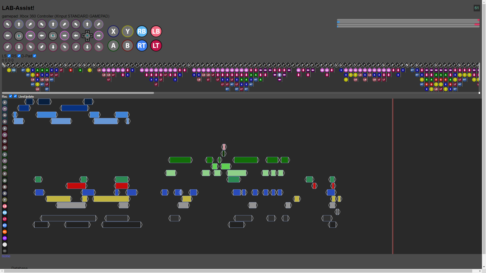

# LAB-Assist (Largely Audio-Based Assistant)

This is an Angular-based web-implementation of a fusion between a controller input viewer and MIDI sequencer / Recorder. It's ultimate intent is to allow the viewing / recording / modifying of inputs with dynamically-generated musical playback to assist in learning timing-intensive games and strategies, e.g. Fighting games, Character-Action games, and Speedrunning.

### NOTE: To Those who want to run/test with a controller
- Works best with an Xbox 360 / Xbox One / XSX / XInput Controller, partial and inaccurate functionality also possible with alternatives, but not guaranteed due to lack of ability to test, currently.

## Installing, Running and Troubleshooting (Requires Node.js [16.13.1 LTS: current version in use in development])
### If you have run a version from before 12/28/21, you may have to upgrade your version of Node.js, though only if version < 12
### Install
- Download the latest main branch source code and extract to a local file path
- After navigating to the local folder in a terminal, run `npm install` to generate necessary files
### Running
- Run `ng serve` in the terminal to start a dev server. Once initialized, use a browser (Chrome recommended) and navigate to `http://localhost:4200/`

#### further compiling issues / updating an existing local folder
- Run `npm update`, though a clean install is recommended

## Hopefully Near-Future Improvements / Upgrades

- Overhauling visual/interface components.
  - Including more customizablility in button arrangement and color schemes, adding different platform schemes and game-dependent labelling
  - show/hide different direcitonal inputs in editor
  - Proper input display playback from the editor
- Implementing the 'Melodic Phrase' generator for playback
  - Arbitrarily sequential and procedural at first, then grouped based on input cluster recognition and user-selected grouping
  - Implement basic triad/chording for movement phrases, and melodic accompaniment for buttons, both based on chosen key & scale
  - Eventually creating more diverse and unique melodic interactions for longer/divergent input sequences, including different cadences/key shifts for branching input options (particularly in regard to fighting games and their combo systems)
  - Implementing input 'Rehearsal' AKA matching the playback and subsequent feedback
- Fully implementing the database component and a proper interface for searching, tagging and loading different combos / inputs

### Current Speculative Upgrades
- Looking into an Electron-based desktop app version to be upgraded in sync with the web app (as much as possible)
  -  Would make overlaying and syncing with other desktop apps natively much easier, for feature testing purposes
  -  Overlay would be initially focused on displaying a universal input history, but would eventually include live controller overlays along with different rehearsal prompt types once rehearsal is fully implemented

